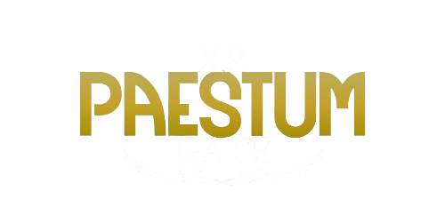

<a id="readme-top"></a>

<!-- PROJECT SHIELDS -->
<!--
*** I'm using markdown "reference style" links for readability.
*** Reference links are enclosed in brackets [ ] instead of parentheses ( ).
*** See the bottom of this document for the declaration of the reference variables
*** for contributors-url, forks-url, etc. This is an optional, concise syntax you may use.
*** https://www.markdownguide.org/basic-syntax/#reference-style-links
-->
[![Contributors][contributors-shield]][contributors-url]
[![Forks][forks-shield]][forks-url]
[![Stargazers][stars-shield]][stars-url]
[![Issues][issues-shield]][issues-url]
[![project_license][license-shield]][license-url]
[![LinkedIn][linkedin-shield]][linkedin-url]

<!-- PROJECT LOGO -->
<br />
<div align="center">
  <a href="https://github.com/isislab-unisa/xrpaestumgate">
    
  </a>

<h3 align="center">XR-PaestumGate</h3>

  <p align="center">
    XR-PaestumGate is an open source serious game developed in Unity for desktop devices and VR headsets
    <br/>
    <a href="https://github.com/isislab-unisa/xrpaestumgate"><strong>Explore the docs »</strong></a>
    <br />
    <br />
    <a href="#download">Download</a>
    &middot;
    <a href="https://github.com/isislab-unisa/xrpaestumgate/issues/new?labels=bug&template=bug-report---.md">Report Bug</a>
    &middot;
    <a href="https://github.com/isislab-unisa/xrpaestumgate/issues/new?labels=enhancement&template=feature-request---.md">Request Feature</a>
  </p>
</div>

<!-- TABLE OF CONTENTS -->
<details>
  <summary>Table of Contents</summary>
  <ol>
    <li>
      <a href="#about-the-project">About The Project</a>
      <ul>
        <li><a href="#built-with">Built With</a></li>
      </ul>
    </li>
    <li>
      <a href="#getting-started">Getting Started</a>
      <ul>
        <li><a href="#prerequisites">Prerequisites</a></li>
        <li><a href="#installation">Installation</a></li>
      </ul>
    </li>
    <li><a href="#usage">Usage</a></li>
    <li><a href="#download">Download</a></li>
    <li><a href="#roadmap">Roadmap</a></li>
    <li><a href="#contributing">Contributing</a></li>
    <li><a href="#license">License</a></li>
    <li><a href="#contact">Contact</a></li>
    <li><a href="#acknowledgments">Acknowledgments</a></li>
  </ol>
</details>


<!-- ABOUT THE PROJECT -->
## 📖 About The Project

[](https://drive.google.com/file/d/1E4MpI946NDz0M1To-rnbPUO_zsutUqrt/view?usp=sharing)

XR-PaestumGate explores the potential of immersive technologies such as
    Virtual Reality (VR) in the field of cultural heritage valorization. The open source project extends the virtual reconstruction of the
    archaeological site of Paestum through the design and implementation of
    a serious game (SG) in VR integrating game mechanics designed to increase user involvement and interest.The experience consists of various activities, from exploring the environment to discover its key places to the possibility of driving a roman chariot

<p align="right">(<a href="#readme-top">back to top</a>)</p>

### 🛠 Built With

* [![Unity][Unity]][Unity-url]
* ![Csharp][Csharp]
* [![MetaSDK][MetaSDK]][MetaSDK-url]
* [![3DS][3DS]][3DS-url]

<p align="right">(<a href="#readme-top">back to top</a>)</p>

<!-- GETTING STARTED -->
## 🚀 Getting Started
To get a local copy up and running follow these simple steps:

### 📌 Prerequisites

This is an example of how to list things you need to use the software and how to install them.
Before starting, ensure you have the following installed:
- **Unity Hub** (version recommended: 2022.3.53f1)
- **Unity Editor**
- **Git** (for cloning the repository)
- **Visual Studio** (or another compatible IDE for script editing)
- **Meta Quest Link** and **Meta Quest Developer Hub** (if you have a Meta standalone VR device). Alternatively, download the software from the producer of your vr device
- **3DS Studio Max** (latest version recommended) for import all the scene's prefab. The software is available on a pay-per-use licence, but a 7-day trial is sufficient to import the necessary project requirements


### 🔧 Installation

1. Clone the repo
   ```sh
   git clone https://github.com/isislab-unisa/xrpaestumgate.git
   ```
2. Change git remote url to avoid accidental pushes to base project
   ```sh
   git remote set-url origin github_username/repo_name
   git remote -v # confirm the changes
   ```
3. Open Unity Hub
4. Click **Open** and select the cloned project folder
5. Ensure you have the correct Unity version (2022.3.53f1) installed.
6. Wait for Unity to load the project and compile assets. (ensure you have 3DS Max installed and with active license)
7. Install Dependencies
  - Open the **Package Manager** (`Window` > `Package Manager`)
  - Install any missing dependencies or packages
  - If required, configure **Oculus Plugin Management** for VR support
8. Build
  - Go to File > Build Settings
  - Select the platform: Android
  - Click Switch Platform if needed
  - Setup the *Scenes in Build* with the project Scenes (it is recommended to use the menu scene as first in the list). an example of what it should look like in the image below
  <p align="center">
    
  </p>

9. Run the project
  - Click Play in the Unity Editor to test the game
  - For a standalone build, click **Build and Run** in the Build Settings window. The result is an **apk** file for your VR device

<p align="right">(<a href="#readme-top">back to top</a>)</p>


<!-- USAGE EXAMPLES -->
## 🎮 Usage
The versions (VR and desktop) of the game are divided in two different directories, both have the same game modes:
- Exploration: freely explore the ancient site of Paestum on foot or using the chariot
- Chariot Run: timed chariot race along a predefined route
- Key Places: explore the map and locate the points of interest on the map within a time limit

The following is the Scenes directories:
  <p align="center">
    
  </p>
The subdirectories contains all the Scenes for Desktop and VR version of XR-PaestumGate as visible from the images below
<p align="center">
    
    
</p>

<p align="right">(<a href="#readme-top">back to top</a>)</p>

## ⬇️ Download
Dowload the desktop version or the VR version of XR-PaestumGate \
How to install the apk on your VR Headset:

### Using SideQuest
1. **Download and Install SideQuest**
   - Visit [SideQuest](https://sidequestvr.com/) and download the appropriate version for your operating system.
   - Install the software on your computer.

2. **Enable Developer Mode on Your VR Device**
   - Open the Meta Quest mobile app on your smartphone.
   - Go to **Settings** > Select your device > **Developer Mode**.
   - Toggle **Developer Mode** on and restart your headset.

3. **Connect Your VR Device to the Computer**
   - Use a USB cable to connect your headset to your PC.
   - Put on the headset and allow USB debugging when prompted.

4. **Install the APK**
   - Open SideQuest and ensure your device is detected (green dot in the top left corner).
   - Click the **Install APK file from folder** button (⬇ icon).
   - Select the APK file you want to install and wait for the installation to complete.

### Using Meta Developer Hub
1. **Download and Install Meta Developer Hub**
   - Visit [Meta Developer Hub](https://developer.oculus.com/) and download the tool.
   - Install it on your computer.

2. **Enable Developer Mode** (Follow the same steps as for SideQuest).

3. **Connect Your VR Device**
   - Use a USB cable to connect your headset to your PC.
   - Accept the debugging prompt in the headset.

4. **Install the APK**
   - Open Meta Developer Hub.
   - Navigate to the **Device Manager**.
   - Click on **Install APK** and select your file.
   - Wait for the installation to complete.

### Verifying the Installation
- Put on your headset and go to **Apps** > **Unknown Sources**.
- Locate your installed APK and launch it.

You have now successfully installed an APK on your VR device!


[Desktop exe]()

[Headset apk]()

## 🆘 Troubleshooting
- If errors occur, check the **Console** for logs
- Ensure all **Unity packages** are installed and up to date
- Restart Unity or delete the `Library` folder if necessary
- Verify that **Oculus software** is running (for VR projects)

<p align="right">(<a href="#readme-top">back to top</a>)</p>
<!-- ROADMAP -->

## 🛤 Roadmap

- [ ] New modalities
- [ ] Add hint for keyplaces modality
- [ ] Minimap for VR mode

See the [open issues](https://github.com/isislab-unisa/xrpaestumgate/issues) for a full list of proposed features (and known issues).

<p align="right">(<a href="#readme-top">back to top</a>)</p>


<!-- CONTRIBUTING -->
## 🤝 Contributing

Contributions are what make the open source community such an amazing place to learn, inspire, and create. Any contributions you make are **greatly appreciated**.

If you have a suggestion that would make this better, please fork the repo and create a pull request. You can also simply open an issue with the tag "enhancement".
Don't forget to give the project a star! Thanks again!

1. Fork the Project
2. Create your Feature Branch (`git checkout -b feature/AmazingFeature`)
3. Commit your Changes (`git commit -m 'Add some AmazingFeature'`)
4. Push to the Branch (`git push origin feature/AmazingFeature`)
5. Open a Pull Request

<p align="right">(<a href="#readme-top">back to top</a>)</p>

### Top contributors:

<a href="https://github.com/isislab-unisa/xrpaestumgate/graphs/contributors">
  
</a>


<!-- LICENSE -->
## 📜 License

Distributed under the Apache License. See `LICENSE.txt` for more information.

<p align="right">(<a href="#readme-top">back to top</a>)</p>


<!-- CONTACT -->
## 📧 Contact

Francesco Pio Covino: francescop.covino@gmail.com

Project Link: [https://github.com/isislab-unisa/xrpaestumgate](https://github.com/isislab-unisa/xrpaestumgate)

<p align="right">(<a href="#readme-top">back to top</a>)</p>

<!-- ACKNOWLEDGMENTS -->
## 🎖️ Acknowledgments

* MalbersAnimation (https://malbersanimations.gitbook.io/animal-controller)
* Optimaze cable and ropes (https://assetstore.unity.com/packages/tools/physics/optimized-ropes-and-cables-tool-287164)

<p align="right">(<a href="#readme-top">back to top</a>)</p>


<!-- MARKDOWN LINKS & IMAGES -->
<!-- https://www.markdownguide.org/basic-syntax/#reference-style-links -->
[contributors-shield]: https://img.shields.io/github/contributors/isislab-unisa/xrpaestumgate.svg?style=for-the-badge
[contributors-url]: https://github.com/isislab-unisa/xrpaestumgate/graphs/contributors
[forks-shield]: https://img.shields.io/github/forks/isislab-unisa/xrpaestumgate.svg?style=for-the-badge
[forks-url]: https://github.com/isislab-unisa/xrpaestumgate/network/members
[stars-shield]: https://img.shields.io/github/stars/isislab-unisa/xrpaestumgate.svg?style=for-the-badge
[stars-url]: https://github.com/isislab-unisa/xrpaestumgate/stargazers
[issues-shield]: https://img.shields.io/github/issues/isislab-unisa/xrpaestumgate.svg?style=for-the-badge
[issues-url]: https://github.com/isislab-unisa/xrpaestumgate/issues
[license-shield]: https://img.shields.io/github/license/isislab-unisa/xrpaestumgate.svg?style=for-the-badge
[license-url]: https://github.com/isislab-unisa/xrpaestumgate/blob/master/LICENSE.txt
[linkedin-shield]: https://img.shields.io/badge/-LinkedIn-black.svg?style=for-the-badge&logo=linkedin&colorB=555
[linkedin-url]: https://linkedin.com/in/francesco-pio-covino-583128217
[product-screenshot]: images/pg_explore.png

[MetaSDK]: https://img.shields.io/badge/MetaSDK-004480?style=for-the-badge&logo=meta&logoColor=white
[MetaSDK-url]: https://assetstore.unity.com/packages/tools/integration/meta-xr-all-in-one-sdk-269657?srsltid=AfmBOoqObQxPqmkF85OxNLQzknZ7oVrC0elOFHLKG1Rf2uxe7eLfJfUQ

[3DS]: https://img.shields.io/badge/3DSStudioMax-004480?style=for-the-badge&logo=3ds&logoColor=white
[3DS-url]: https://www.autodesk.com/it/products/3ds-max/

[Unity]: https://img.shields.io/badge/unity-000000?style=for-the-badge&logo=unity&logoColor=white
[Unity-url]: https://unity.com/

[Csharp]: https://img.shields.io/badge/C%23-00C244?style=for-the-badge